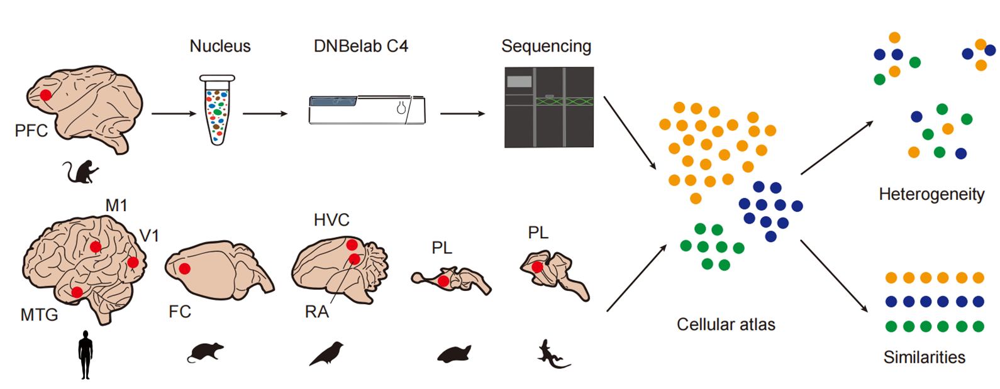
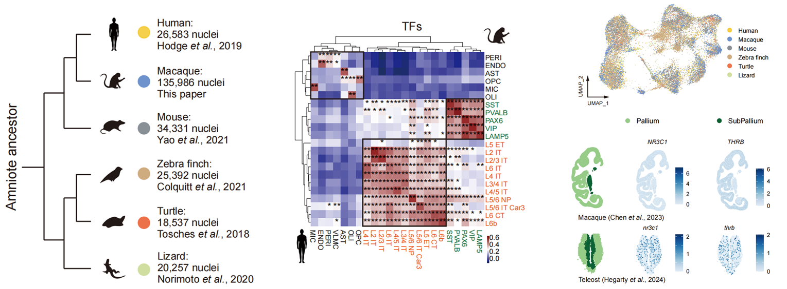

# AmniotePalliumTranscriptome
Cross-species Single-cell Transcriptomics Reveals Neuronal Similarities and Heterogeneity in Amniote Pallium

Comparative analysis

### Highlights:
- 1.Single-cell transcriptomic atlas of macaque prefrontal cortex (PFC) is provided 
- 2.Comparative analysze reveals conserved and species-specific cell subtypes
- 3.Correlations using varied gene sets uncovered different biological significance of TFs and HVGs
- 4.Key TF candidates with potential roles in neural functions were screened